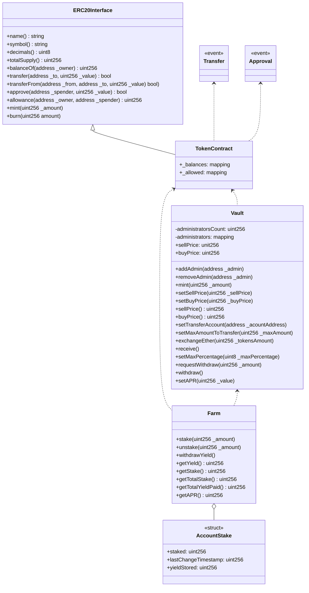

# Contracts

```mermaid
classDiagram

ERC20Interface <|-- TokenContract
TokenContract <.. Farm
Vault <.. Farm
TokenContract <.. Vault
Transfer <.. TokenContract
Approval <.. TokenContract
Farm o-- AccountStake

class ERC20Interface {
    +name() string
    +symbol() string
    +decimals() uint8
    +totalSupply() uint256
    +balanceOf(address _owner) uint256
    +transfer(address _to, uint256 _value) bool
    +transferFrom(address _from, address _to, uint256 _value) bool)
    +approve(address _spender, uint256 _value) bool
    +allowance(address _owner, address _spender) uint256
    +mint(uint256 _amount)
    +burn(uint256 amount)
}

class TokenContract {
    +_balances: mapping
    +_allowed: mapping
}

class Transfer {
    <<event>>
}

class Approval {
    <<event>>
}

class Vault {
    -administratorsCount: uint256
    -administrators: mapping
    +sellPrice: unit256
    +buyPrice: uint256
    
    +addAdmin(address _admin)
    +removeAdmin(address _admin)
    +mint(uint256 _amount)
    +setSellPrice(uint256 _sellPrice)
    +setBuyPrice(uint256 _buyPrice)
    +sellPrice() uint256
    +buyPrice() uint256
    +setTransferAccount(address _acountAddress) 
    +setMaxAmountToTransfer(uint256 _maxAmount)
    +exchangeEther(uint256 _tokensAmount)
    +receive()
    +setMaxPercentage(uint8 _maxPercentage)
    +requestWithdraw(uint256 _amount)
    +withdraw()
    +setAPR(uint256 _value)
}

class Farm {
    +stake(uint256 _amount)
    +unstake(uint256 _amount)
    +withdrawYield()
    +getYield() uint256
    +getStake() uint256
    +getTotalStake() uint256 
    +getTotalYieldPaid() uint256
    +getAPR() uint256
}

class AccountStake {
    <<struct>>
    +staked: uint256
    +lastChangeTimestamp: uint256
    +yieldStored: uint256
}
```