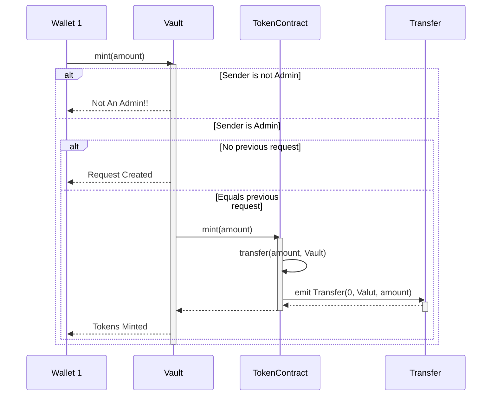
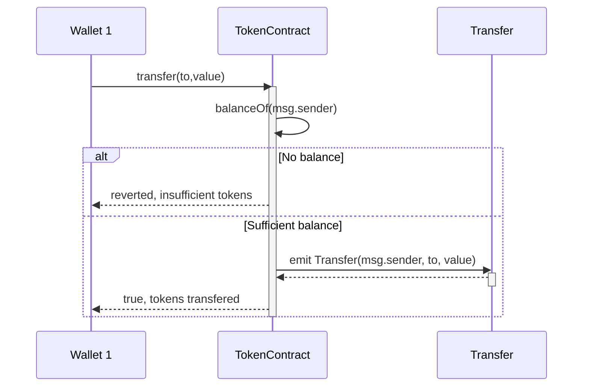
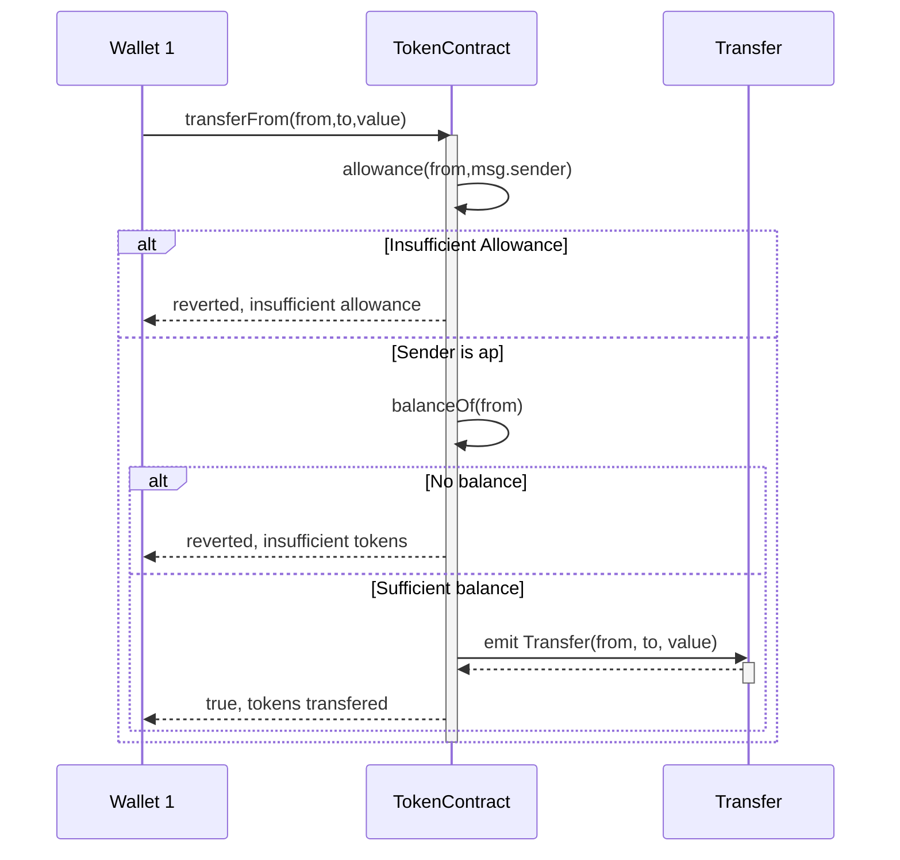
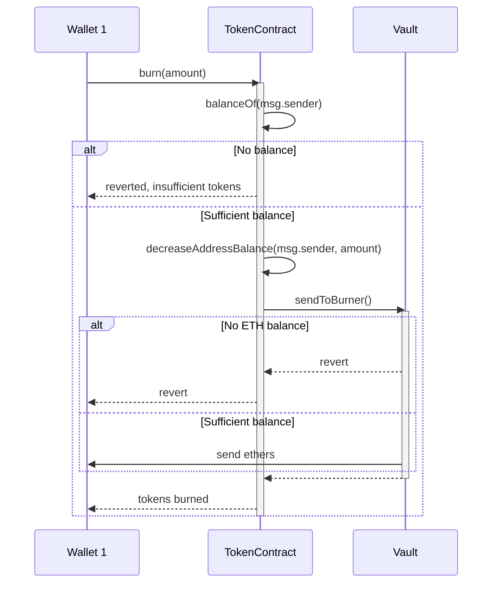
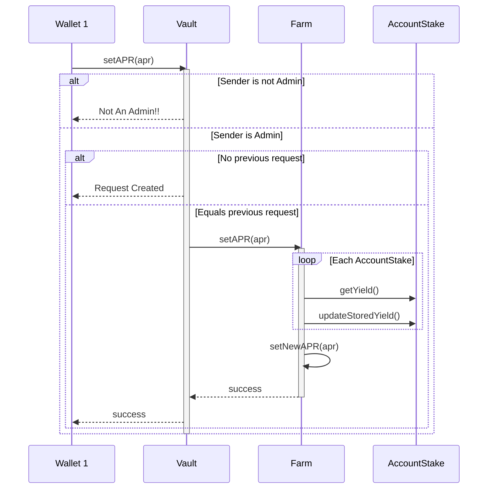

# Sequence Diagrams

Sequence diagram for the most interesting functions in the contracts:

## Token Minting

```mermaid
sequenceDiagram

Wallet 1->>Vault: mint(amount)
activate Vault
alt Sender is not Admin
    Vault-->>Wallet 1: Not An Admin!!
else Sender is Admin
    alt No previous request
        Vault-->>Wallet 1: Request Created
    else Equals previous request
        Vault->>TokenContract: mint(amount)
        activate TokenContract
        TokenContract->>TokenContract: transfer(amount, Vault)
        TokenContract->>Transfer: emit Transfer(0, Valut, amount)
        activate Transfer
        Transfer-->>TokenContract: 
        deactivate Transfer
        TokenContract-->>Vault: 
        deactivate TokenContract
        Vault-->>Wallet 1: Tokens Minted
    end
end
deactivate Vault
```

## Token Transfer

```mermaid
sequenceDiagram

Wallet 1->>TokenContract: transfer(to,value)
activate TokenContract
TokenContract->>TokenContract: balanceOf(msg.sender)
alt No balance
    TokenContract-->>Wallet 1: reverted, insufficient tokens
else Sufficient balance
    TokenContract->>Transfer: emit Transfer(msg.sender, to, value)
    activate Transfer
    Transfer-->>TokenContract: 
    deactivate Transfer
    TokenContract-->>Wallet 1: true, tokens transfered
end
deactivate TokenContract
```

## Token Transfer From

```mermaid
sequenceDiagram

Wallet 1->>TokenContract: transferFrom(from,to,value)
activate TokenContract
TokenContract->>TokenContract: allowance(from,msg.sender)
alt Insufficient Allowance
    TokenContract-->>Wallet 1: reverted, insufficient allowance
else Sender is ap
    TokenContract->>TokenContract: balanceOf(from)
    alt No balance
        TokenContract-->>Wallet 1: reverted, insufficient tokens
    else Sufficient balance
        TokenContract->>Transfer: emit Transfer(from, to, value)
        activate Transfer
        Transfer-->>TokenContract: 
        deactivate Transfer
        TokenContract-->>Wallet 1: true, tokens transfered
    end
end
deactivate TokenContract
```

## Token Burn

```mermaid
sequenceDiagram
Wallet 1->>TokenContract: burn(amount)
activate TokenContract
TokenContract->>TokenContract: balanceOf(msg.sender)
alt No balance
    TokenContract-->>Wallet 1: reverted, insufficient tokens
else Sufficient balance
    TokenContract->>TokenContract: decreaseAddressBalance(msg.sender, amount)
    TokenContract->>Vault: sendToBurner()
    activate Vault
    alt No ETH balance
        Vault-->>TokenContract: revert
        TokenContract-->>Wallet 1: revert
    else Sufficient balance
        Vault->>Wallet 1: send ethers
    end
    Vault-->>TokenContract: 
    deactivate Vault
    TokenContract-->>Wallet 1: tokens burned
end
deactivate TokenContract
```

## Change APR

```mermaid
sequenceDiagram
Wallet 1->>Vault: setAPR(apr)
activate Vault
alt Sender is not Admin
    Vault-->>Wallet 1: Not An Admin!!
else Sender is Admin
    alt No previous request
        Vault-->>Wallet 1: Request Created
    else Equals previous request
        Vault->>Farm: setAPR(apr)
        activate Farm
        loop Each AccountStake
            Farm->>AccountStake: getYield()
            Farm->>AccountStake: updateStoredYield()
        end
        Farm->>Farm: setNewAPR(apr)
        Farm-->>Vault: success
        deactivate Farm
        Vault-->>Wallet 1: success
    end
end
deactivate Vault
```